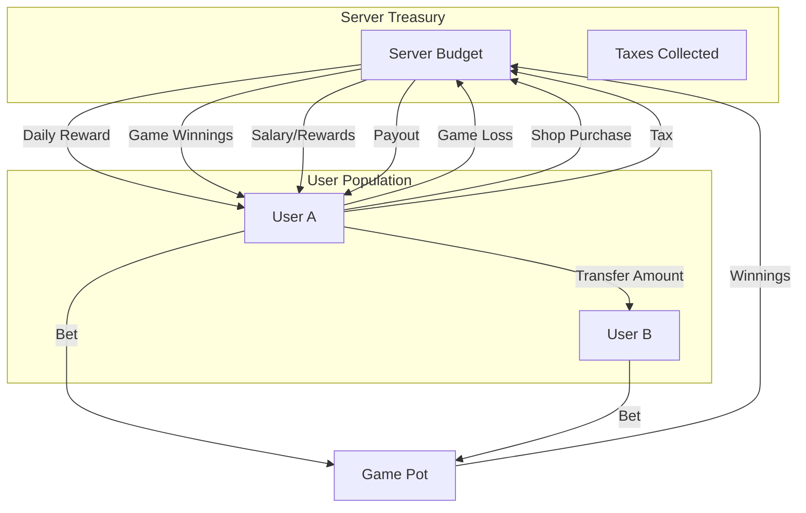

# Economic System Audit & Money Flow

## Overview

The JJI Squad Bot operates on a **closed-loop economy model**. The `ServerEconomy` table acts as a central bank (Treasury). Money is rarely created out of thin air; instead, it flows between Users and the System.

## Money Sources (Mint / Inflow from System)

These actions increase the total money supply in User circulation, usually by deducting from the Server Budget.

| Source | Command/Action | Details | Budget Impact |
| :--- | :--- | :--- | :--- |
| **Daily/Case** | `/case`, `/daily` | Random reward ($2-$17) | **Deducts** from Budget (Reward) |
| **Games Win** | `/blackjack`, `/coinflip` | Winnings | **Deducts** from Budget |
| **Officer Reward** | `/accept` | Recruiting a new soldier | **Deducts** from Budget |
| **Officer Bonus** | 10h PB Bonus | Bonus for recruit activity | **Deducts** from Budget |
| **Soldier Salary** | Periodic | Salary based on rank | **Deducts** from Budget |
| **Admin Add** | `/addbalance` | Admin intervention | **Deducts** from Budget (if positive) |

## Money Sinks (Burn / Outflow to System)

These actions decrease the total money supply in User circulation, usually by adding to the Server Budget.

| Sink | Command/Action | Details | Budget Impact |
| :--- | :--- | :--- | :--- |
| **Tax** | `/pay`, Shop, Rewards | Percentage (default 10%) | **Adds** to Budget |
| **Game Loss** | `/blackjack`, `/coinflip` | Losing a bet | **Adds** to Budget |
| **Shop Purchase** | `/shop` | Buying roles | **Adds** to Budget |
| **Fine** | `/fine` | Admin penalty | **Adds** to Budget |
| **Admin Remove** | `/addbalance` (negative) | Admin intervention | **Adds** to Budget |

## Money Flow Diagram

## Conservation of Money

In a strictly closed-loop system:
$$ \Delta \text{UserBalances} + \Delta \text{ServerBudget} = 0 $$

However, currently:
1.  **Inflation Risks**: If the Server Budget runs dry, rewards might fail, or checks might be bypassed.
2.  **Deflation**: Taxes and losses constantly move money to the Budget.
3.  **Admin Intervention**: Can inject or remove money arbitrarily.

## Detailed Flow Analysis

### 1. Peer-to-Peer Transfer (`/pay`)
- **Input**: `amount` from Sender
- **Tax**: `amount * tax_rate` -> System
- **Output**: `amount - tax` -> Recipient
- **Net Change**: User Supply decreases by `tax`; System Budget increases by `tax`.

### 2. Gambling (`/blackjack`)
- **Bet**: `amount` -> System Budget immediately.
- **Win**: `payout` -> User from System Budget.
- **Loss**: No action (money already in System).
- **Push**: `amount` -> Refunded to User from System Budget.

### 3. Role Shop (`/shop`)
- **Purchase**: `price + tax` -> System Budget.
- **Sale**: `price * refund_rate` -> User from System Budget.

### 4. Daily Case (`/case`)
- **Reward**: `amount` -> User from System Budget.
